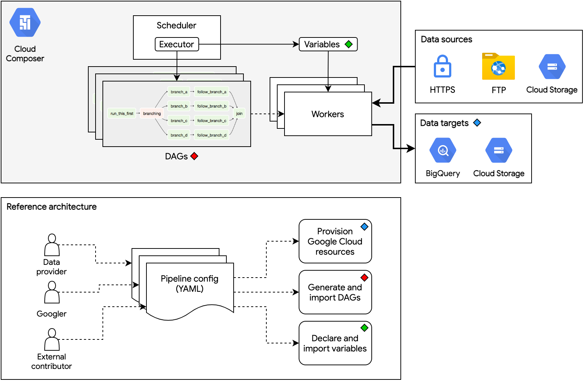

# Public Datasets Pipelines

Cloud-native, data pipeline architecture for onboarding public datasets to [Datasets for Google Cloud](https://cloud.google.com/solutions/datasets).

# Overview



# Requirements
- Python `>=3.6.10,<3.9`. We currently use `3.8`. For more info, see the [Cloud Composer version list](https://cloud.google.com/composer/docs/concepts/versioning/composer-versions).
- Familiarity with [Apache Airflow](https://airflow.apache.org/docs/apache-airflow/stable/concepts/index.html) (>=v2.1)
- [pipenv](https://pipenv-fork.readthedocs.io/en/latest/install.html#installing-pipenv) for creating similar Python environments via `Pipfile.lock`
- [gcloud](https://cloud.google.com/sdk/gcloud) command-line tool with Google Cloud Platform credentials configured. Instructions can be found [here](https://cloud.google.com/sdk/docs/initializing).
- [Terraform](https://learn.hashicorp.com/tutorials/terraform/install-cli) `>=v0.15.1`
- [Google Cloud Composer](https://cloud.google.com/composer/docs/concepts/overview) environment running [Apache Airflow](https://airflow.apache.org/docs/apache-airflow/stable/concepts.html) `>=2.0`. To create a new Cloud Composer environment, see [this guide](https://cloud.google.com/composer/docs/how-to/managing/creating).

# Environment Setup

We use Pipenv to make environment setup more deterministic and uniform across different machines.

If you haven't done so, install Pipenv using the instructions found [here](https://pipenv-fork.readthedocs.io/en/latest/install.html#installing-pipenv). Now with Pipenv installed, run the following command:

```bash
pipenv install --ignore-pipfile --dev
```

This uses the `Pipfile.lock` found in the project root and installs all the development dependencies.

Finally, initialize the Airflow database:

```bash
pipenv run airflow db init
```

# Building Data Pipelines

Configuring, generating, and deploying data pipelines in a programmatic, standardized, and scalable way is the main purpose of this repository.

Follow the steps below to build a data pipeline for your dataset:

## 1. Create a folder hierarchy for your pipeline

```
mkdir -p datasets/DATASET/PIPELINE

[example]
datasets/covid19_tracking/national_testing_and_outcomes
```

where `DATASET` is the dataset name or category that your pipeline belongs to, and `PIPELINE` is your pipeline's name.

For examples of pipeline names, see [these pipeline folders in the repo](https://github.com/GoogleCloudPlatform/public-datasets-pipelines/tree/main/datasets/covid19_tracking).

Use only underscores and alpha-numeric characters for the names.


## 2. Write your config (YAML) files

If you created a new dataset directory above, you need to create a `datasets/DATASET/dataset.yaml` config file. See this [section](https://github.com/GoogleCloudPlatform/public-datasets-pipelines/blob/main/README.md#yaml-config-reference) for the `dataset.yaml` reference.

Create a `datasets/DATASET/PIPELINE/pipeline.yaml` config file for your pipeline. See [here](https://github.com/GoogleCloudPlatform/public-datasets-pipelines/blob/main/samples/) for the `pipeline.yaml` references. 

For a YAML config template using Airflow 1.10 operators, see [`samples/pipeline.airflow1.yaml`](https://github.com/GoogleCloudPlatform/public-datasets-pipelines/blob/main/samples/pipeline.airflow1.yaml).

If you'd like to get started faster, you can inspect config files that already exist in the repository and infer the patterns from there:

- [covid19_tracking](https://github.com/GoogleCloudPlatform/public-datasets-pipelines/blob/main/datasets/covid19_tracking/dataset.yaml) dataset config
- [covid19_tracking/national_testing_and_outcomes](https://github.com/GoogleCloudPlatform/public-datasets-pipelines/blob/main/datasets/covid19_tracking/national_testing_and_outcomes/pipeline.yaml) pipeline config (simple, only uses built-in Airflow operators)
- [covid19_tracking/city_level_cases_and_deaths](https://github.com/GoogleCloudPlatform/public-datasets-pipelines/blob/main/datasets/covid19_tracking/city_level_cases_and_deaths/pipeline.yaml) pipeline config (involves custom data transforms)

Every YAML file supports a `resources` block. To use this, identify what Google Cloud resources need to be provisioned for your pipelines. Some examples are

- BigQuery datasets and tables to store final, customer-facing data
- GCS bucket to store intermediate, midstream data.
- GCS bucket to store final, downstream, customer-facing data
- Sometimes, for very large datasets, you might need to provision a [Dataflow](https://cloud.google.com/dataflow/docs) job
## 3. Generate Terraform files and actuate GCP resources

Run the following command from the project root:
```bash
$ pipenv run python scripts/generate_terraform.py \
    --dataset DATASET_DIR_NAME \
    --gcp-project-id GCP_PROJECT_ID \
    --region REGION \
    --bucket-name-prefix UNIQUE_BUCKET_PREFIX \
    [--env] dev \
    [--tf-state-bucket] \
    [--tf-state-prefix] \
    [--tf-apply] \
    [--impersonating-acct] IMPERSONATING_SERVICE_ACCT
```

This generates Terraform files (`*.tf`) in a `_terraform` directory inside that dataset. The files contain instrastructure-as-code on which GCP resources need to be actuated for use by the pipelines. If you passed in the `--tf-apply` parameter, the command will also run `terraform apply` to actuate those resources.

The `--bucket-name-prefix` is used to ensure that the buckets created by different environments and contributors are kept unique. This is to satisfy the rule where bucket names must be globally unique across all of GCS. Use hyphenated names (`some-prefix-123`) instead of snakecase or underscores (`some_prefix_123`).

The `--tf-state-bucket` and `--tf-state-prefix` parameters can be optionally used if one needs to use a remote store for the Terraform state. This will create a `backend.tf` file that points to the GCS bucket and prefix to use in storing the Terraform state. For more info, see the [Terraform docs for using GCS backends](https://www.terraform.io/docs/language/settings/backends/gcs.html).

In addition, the command above creates a "dot" directory in the project root. The directory name is the value you pass to the `--env` parameter of the command. If no `--env` argument was passed, the value defaults to `dev` (which generates the `.dev` folder).

Consider this "dot" directory as your own dedicated space for prototyping. The files and variables created in that directory will use an isolated environment. All such directories are gitignored.

As a concrete example, the unit tests use a temporary `.test` directory as their environment.

## 4. Generate DAGs and container images

Run the following command from the project root:

```bash
$ pipenv run python scripts/generate_dag.py \
    --dataset DATASET_DIR \
    --pipeline PIPELINE_DIR \
    [--skip-builds] \
    [--env] dev
```

This generates a Python file that represents the DAG (directed acyclic graph) for the pipeline (the dot dir also gets a copy). To standardize DAG files, the resulting Python code is based entirely out of the contents in the `pipeline.yaml` config file.

Using `KubernetesPodOperator` requires having a container image available for use. The command above allows this architecture to build and push it to [Google Container Registry](https://cloud.google.com/container-registry) on your behalf. Follow the steps below to prepare your container image:

1. Create an `_images` folder under your dataset folder if it doesn't exist.

2. Inside the `_images` folder, create another folder and name it after what the image is expected to do, e.g. `process_shapefiles`, `read_cdf_metadata`.

3. In that subfolder, create a [Dockerfile](https://docs.docker.com/engine/reference/builder/) and any scripts you need to process the data. See the [`samples/container`](https://github.com/GoogleCloudPlatform/public-datasets-pipelines/blob/main/samples/container/) folder for an example. Use the [COPY command](https://docs.docker.com/engine/reference/builder/#copy) in your `Dockerfile` to include your scripts in the image.

The resulting file tree for a dataset that uses two container images may look like

```
datasets
└── DATASET
    ├── _images
    │   ├── container_a
    │   │   ├── Dockerfile
    │   │   ├── requirements.txt
    │   │   └── script.py
    │   └── container_b
    │       ├── Dockerfile
    │       ├── requirements.txt
    │       └── script.py
    ├── _terraform/
    ├── PIPELINE_A
    ├── PIPELINE_B
    ├── ...
    └── dataset.yaml
```

Docker images will be built and pushed to GCR by default whenever the command above is run. To skip building and pushing images, use the optional `--skip-builds` flag.

## 5. Declare and set your Airflow variables

Running the command in the previous step will parse your pipeline config and inform you about the Airflow variables that your pipeline expects to use and must be defined.

If your pipeline doesn't use any Airflow variables, you can skip this step. 

There are two types of variables that pipelines can use: **shared** and **dataset-specific**. Shared variables are those that can be reused by other pipelines in the same Airflow or Cloud Composer environment. These are variables that stay constant from pipeline to pipeline. Examples of shared variables include your Cloud Composer environment name and bucket, your GCP project ID, and paths to the Airflow DAG and data folders. To prevent duplication, specify your shared variables in one place:

```
  [.dev|.test]/datasets/shared_variables.json
```

and inside the file, nest the variables under a common parent key. For example:

```
{
  "shared": {
    "composer_name": "test-pipelines-abcde1234",
    "composer_bucket": "us-east4-test-pipelines-abcde1234-bucket",
    "airflow_data_folder": "/home/airflow/gcs/data"
  }
}
```

For dataset-specific variables, create the following file

```
  [.dev|.test]/datasets/{DATASET}/{DATASET}_variables.json
```

In general, pipelines use the JSON dot notation to access Airflow variables. Make sure to define and nest your variables under some parent key when writing to the JSON files above. We recommend using your dataset's name as the parent key, to mimic the same structure as the folder hierarchy. Airflow variables are globally accessed by any pipeline, which means nesting your variables helps avoid collisions. For example, if you're using the following variables in your pipeline config:

- `{{ var.json.shared.composer_bucket }}`
- `{{ var.json.parent.nested }}`
- `{{ var.json.parent.another_nested }}`

then your variables JSON file should look like this

```json
{
  "parent": {
    "nested": "some value",
    "another_nested": "another value"
  }
}

```

## 6. Deploy the DAGs and variables

Deploy the DAG and the variables to your own Cloud Composer environment using one of the two commands:

```
$ pipenv run python scripts/deploy_dag.py \
  --dataset DATASET \
  [--pipeline PIPELINE] \
  --composer-env CLOUD_COMPOSER_ENVIRONMENT_NAME \
  --composer-bucket CLOUD_COMPOSER_BUCKET \
  --composer-region CLOUD_COMPOSER_REGION \
  --env ENV
```

The specifying an argument to `--pipeline` is optional. By default, the script deploys all pipelines under the given `--dataset` argument.

# Testing

Run the unit tests from the project root as follows:

```
$ pipenv run python -m pytest -v
```

# YAML Config Reference

Every dataset and pipeline folder must contain a `dataset.yaml` and a `pipeline.yaml` configuration file, respectively.

The `samples` folder contains references for the YAML config files, complete with descriptions for config blocks and Airflow operators and parameters. When creating a new dataset or pipeline, you can copy them to your specific dataset/pipeline paths to be used as templates.

- For dataset configuration syntax, see the [`samples/dataset.yaml`](https://github.com/GoogleCloudPlatform/public-datasets-pipelines/blob/main/samples/dataset.yaml) reference.
- For pipeline configuration syntax:
  - For the default Airflow 2 operators, see the [`samples/pipeline.yaml`](https://github.com/GoogleCloudPlatform/public-datasets-pipelines/blob/main/samples/pipeline.yaml) reference.
  - If you'd like to use Airflow 1.10 operators, see the [`samples/pipeline.airflow1.yaml`](https://github.com/GoogleCloudPlatform/public-datasets-pipelines/blob/main/samples/pipeline.yaml) as a reference.


# Best Practices

- When your tabular data contains percentage values, represent them as floats between 0 to 1.
- To represent hierarchical data in BigQuery, use either: 
  - (Recommended) Nested columns in BigQuery. For more info, see [the documentation on nested and repeated columns](https://cloud.google.com/bigquery/docs/nested-repeated).
  - Or, represent each level as a separate column. For example, if you have the following hierarchy: `chapter > section > subsection`, then represent them as

    ```
    |chapter          |section|subsection          |page|
    |-----------------|-------|--------------------|----|
    |Operating Systems|       |                    |50  |
    |Operating Systems|Linux  |                    |51  |
    |Operating Systems|Linux  |The Linux Filesystem|51  |
    |Operating Systems|Linux  |Users & Groups      |58  |
    |Operating Systems|Linux  |Distributions       |70  |
    ```

- When running `scripts/generate_terraform.py`, the argument `--bucket-name-prefix` helps prevent GCS bucket name collisions because bucket names must be globally unique. Use hyphens over underscores for the prefix and make it as unique as possible, and specific to your own environment or use case.
- When naming BigQuery columns, always use `snake_case` and lowercase.
- When specifying BigQuery schemas, be explicit and always include `name`, `type` and `mode` for every column. For column descriptions, derive it from the data source's definitions when available.
- When provisioning resources for pipelines, a good rule-of-thumb is one bucket per dataset, where intermediate data used by various pipelines (under that dataset) are stored in distinct paths under the same bucket. For example:

  ```
  gs://covid19-tracking-project-intermediate
      /dev
          /preprocessed_tests_and_outcomes
          /preprocessed_vaccinations
      /staging
          /national_tests_and_outcomes
          /state_tests_and_outcomes
          /state_vaccinations
      /prod
          /national_tests_and_outcomes
          /state_tests_and_outcomes
          /state_vaccinations

  ```
  The "one bucket per dataset" rule prevents us from creating too many buckets for too many purposes. This also helps in discoverability and organization as we scale to thousands of datasets and pipelines.

  Quick note: If you can conveniently fit the data in memory, the data transforms are close-to-trivial and are computationally cheap, you may skip having to store mid-stream data. Just apply the transformations in one go, and store the final resulting data to their final destinations.
